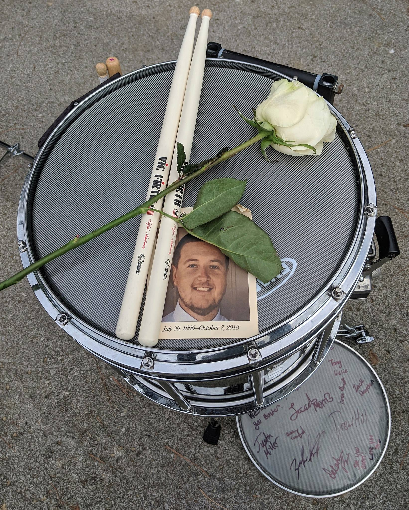

I'm only 23 years old as of the date of this post. People who are the same age or similar as I am make the assumption (a generally safe assumption) that the friends they have who are about as old as they are will be around tomorrow to continue carrying on, having a good time, and being good company. This past week showed me how dangerous it is to continue believing in that assumption.

Hunter Todd Henderson passed away on Sunday, October 7th 2018. From what I know, he was hanging out with friends Saturday evening, and fell out of the bed of a truck. He hit his head on the pavement just right, and never woke up. He was 22 years old, recently engaged, and had a great job in an electrical union. His mom recently passed away from cancer in May.

Up until this point, I have been fortunate enough to not have experienced a death of someone close to me. The past several days have been an eye-opening experience, albeit a confusing one. I travelled to my hometown of Owensboro to get together with my drumline buddies that all knew Hunter as part of the brotherhood we had established in marching band. It had been 6 years since we had all been together in the same place. I never would have thought the reason I regrouped with them was going to be to attend the funeral of one. We had a great time sharing memories of our "good old days" in high school marching band, laughing at the stupid stuff we did, and talking about the times that Hunter would make us smile. I didn't feel sad until I rode in the funeral procession. From then on, I started getting emotional. I didn't expect to be sad -- I expected this to be a time where we celebrated the life we knew with Hunter.

Now for the confusing part. I'm not going to pretend that I'm even remotely as close to Hunter as some of the others from the drumline are. One of them was supposed to go fishing with him on Sunday and they regularly got together to just hang out and have a good time. As for myself, I have had one conversation with him over Facebook Messenger since I graduated almost 6 years ago. Part of me felt like I didn't have a right to be upset because of these reasons, but I was. There was so much of a difference between myself and the rest of the group during high school that at times I felt like I didn't fit in with them, and that difference has become even bigger in the past years since I haven't kept touch with all of them.

That familiar feeling came back even as we all sat at lunch after his burial ceremony. I didn't have much to talk about. The things that I find interesting now are things that no one there would even be a little bit interested in. I continued to feel like I didn't have a right to be upset.

I eventually came to terms with this the more I thought about it. The people Hunter was close to in these past few years don't have the same bond or the same connection that he, I, and the rest of the drumline had. There's something about being in a drumline, being a part of something that makes you literally become one with each other, and spending that much time in that intense of an experience that no one else will really understand. My grief was not only for the loss of a friend, but it was for the definitive ending of an era that his death brought alongside it. I will never have the opportunity to do something like that again. Even if I was to go find a drumline to play with today, there is nothing comparable to what I had with the drumline that Hunter was a part of.

We had the privilege and the honor of playing a few notes at his burial. We started out with the simplest warmup we ever played, and it was one of the hardest things I've ever performed. I have never played a harder rep of 8-on-a-hand in my life. It was a exhilarating and emotional experience to line up the drums to play with him one last time.

Until the day I join you to play again, rest easy and play some clean beats for me. Rest in peace, Hunter.

