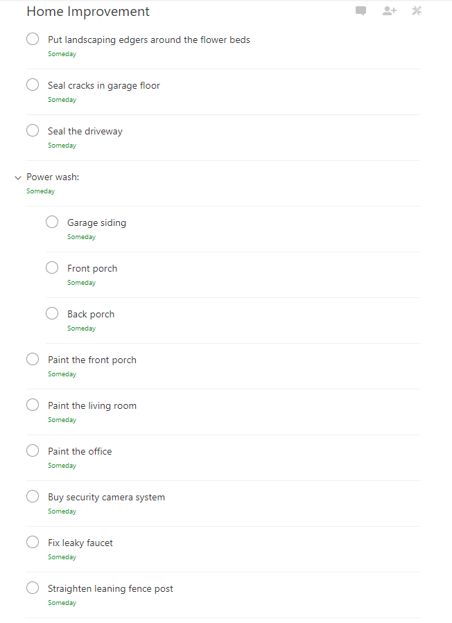

## Day 13
### *Perform a mind dump of everything you’re worried about. From the leaky dishwasher to your family member’s poor health – get it all out. (Use David Allen’s GTD trigger list to help you out if needed.)*
#### 6/22/2018

There are a lot of things that I tend to worry about on a regular basis, but not very many of them really stress me out. I feel like I have a good handle on the things I worry about in the sense that I know they need to be done or they are something that needs my attention, but I don't get sick over worrying about them. There are far too many people that worry over the smallest things so much that it actually affects their health.

With that being said, I do worry about many things. Even though I'm in a comfortable state, money is quite often at the top of that list. I have a pretty healthy savings account, a stable job, and a skillset that will continue to let me earn more money as I grow older. But, seeing the number in my checking account dwindle makes me twitch a little from time to time, and I doubt that will ever go away unless I win the lottery or something.

Even though I don't worry about it so much any more, I used to worry a lot about whether I was a good developer or not. I suffered from Impostor Syndrome pretty heavily when I first started working as a developer. Now I know that I am very skilled, but I also know that there is a lot to learn. I've gotten to the point where if I start thinking "is this the right way to do this?" then I will force myself to make a decision and don't give it a second thought unless someone tells me otherwise. More often than not in this case, my implementations have been aligned with best practices or even better. I don't have a fear of having an inability to meet expectations any more.

I'm starting some serious freelance ventures, namely a few projects for a friend of mine I met over the net. He is a contractor himself, and continues to bring me opportunities from the company he is partnered with at the moment. These projects could net me some serious cash, but they are still completely written by me and no one else. I collaborate with my friend on them for ideas, but I do all of the design and development. Being in that position is a new experience, but I love it. It doesn't come without its own worries though. I'm afraid I may not deliver what they want, or something could go wrong and I would be responsible.

My fiancee and I are trying to plan a wedding, and that's obviously worrisome in and of itself. We just put a deposit down on a venue, but now we have to pick food for catering, find a DJ, find flowers, get pictures done, gather addresses for invites, send out invites, create a registry, get things to wear (dress/suits), pick the wedding party, and so much more. It's 373 days from today so we have a little bit of time, but just a little over a year will go by before I know it.

Even as the prompt says, I do worry about the leaky faucet in my bathroom. I actually have a to-do list of home improvement projects that I want to complete. These are things that I tell myself I'm going to do every weekend, then end up not doing them.

I worry about the gaming community I'm a part of. It has had some struggles recently, and the community has been relatively inactive. I worry that I myself am not doing enough to help keep it from stagnating.

I worry about the portfolio that I have that isn't complete yet. It needs to be complete so I can have a more polished online presence as I grow my freelance career. This goes hand in hand with my worry of a potential company name for my freelance ventures. I've considered something like Click Clack Consulting to represent my love for mechanical keyboards, but that sounds kinda dumb to me.

There are tons of things that I worry about in life, but none of them are significant enough to warrant me getting sick over them. Like I said, I feel like I have a good understanding of what I worry about and how to handle them.

---
[Day 12](./day-12) | [Home](./) | [Day 14](./day-14)