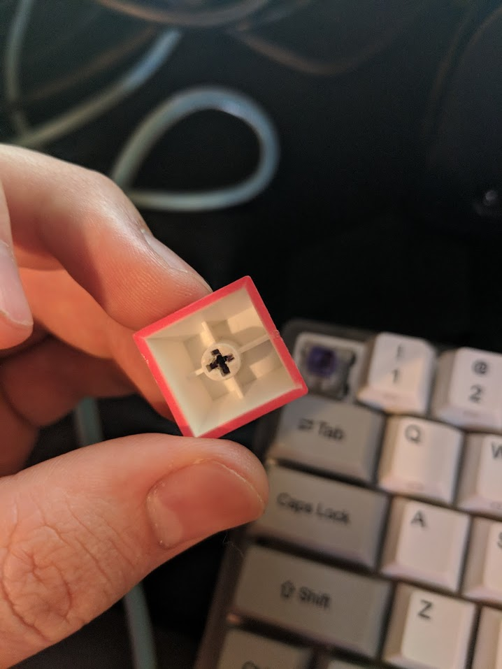
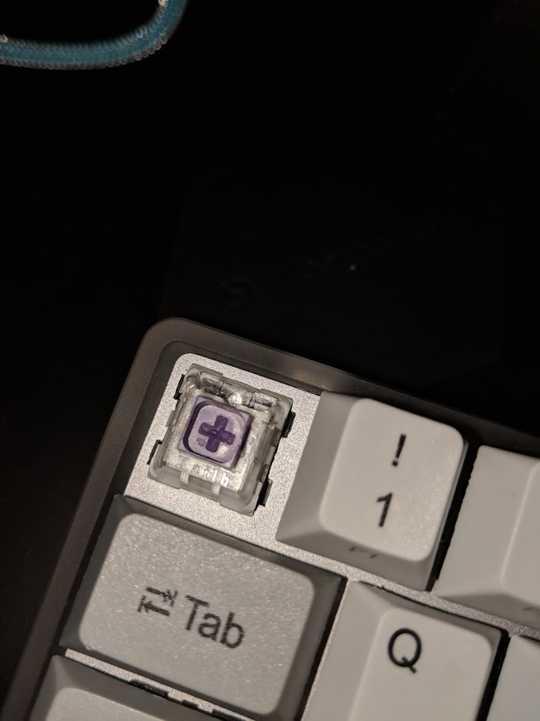

## Day 18
### *Identify one project you’d like to complete with your hands, whether chore or craft. Detail the steps, the resources, and the help you’ll need to complete the project. Then, set about doing it!*
#### 7/10/2018

---

I'll talk about two projects since both of them are things that I am actively working on.

#### The fence post
The first project is fixing the leaning fence post in my back yard. When I moved into this house in late May of last year, this particular post was already leaning. My neighbors that live behind me have kids who play soccer, and they love to kick their soccer balls up against the fence. This resulted in the post leaning even further, and even taking a couple of chunks out of the privacy fence slats that I screwed back on this past weekend. This is obviously bad for the fence and could result in further damage if I don't fix it.

I've already tried straightening it once by digging out about 8 or 9 inches on three sides of the post, then filling them back with the dirt and tamping it as best as I can, but it didn't help much at all. For my next attempt, I'll need several things:

 - An actual spade. I currently only have a flat ended shovel that makes digging through hard ground very difficult.
 - A back of Quikrete or similar. The concrete at the base of the post is crumbling. I'll need something to replace the weakened foundation.
 - Potentially two new fence post slats. As I said, some of the slats have holes in them. I've patched them the best I could, but they're still in rough condition.
 - I already have these, but stakes and twine to tie the post up and hold it straight while I pack the ground back in around it.
 - The willpower to dig the same hole I've already dug, but probably twice as deep. I spent probably an hour and a half attempting to straighten the post once already, and for it to not work at all was really discouraging. I hate having to repeat myself in the work I do on a daily basis, and this is no exception.

First, I'll need to dig out the ground around the post, and get rid of any broken concrete that is contributing to the problem. Then, I'll need to make sure the post is perpendicular with the ground. If it's leaning even slightly, it'll just go back to it's previous state eventually. Next, I'll need to pour some Quikrete in the hole around the post. This will replace the crumbling foundation. Finally, I'll need to replace the dirt that I dug out and probably plant a little grass seed to make it look nicer. Once all of that is done, I can look into replacing the two broken slats. That shouldn't be too hard -- just remove the screws holding the current slats in place, remove the slats, and put new ones in their place.

#### The broken keyboard

The other project is something recent. I bought a keyboard from someone on the [mechmarket subreddit](https://www.reddit.com/r/mechmarket), and during shipping, the switch stem snapped off in the ESC key. Here's some pictures:

The switch stem is stuck in the keycap, and with the stem missing from the switch, the switch becomes unusable since you cannot fit another keycap onto it.

I'm a mechanical keyboard enthusiast, so I was pretty disappointed when I first saw the damage of the keyboard. However, I quickly realized this was an opportunity for me to get deeper into building custom keyboards. It helped that the seller refunded me $10 for my troubles.

I really like this keyboard, so I'm going to take a shot at repairing it myself. Here's what I'll need:

 - A desoldering pump
 - A soldering gun/wand
 - Soldering wire
 - Replacement plate-mounted keyboard switches of my choice (I chose Kailh Box Browns)
 - A 1/32" drill bit with a drill
 - A flathead screwdriver (or something similar to pry a switch off of a plate)

Custom keyboards are awesome. This particular keyboard is an XD64, which, from a retailer, are only sold as DIY kits. You get a case, a PCB (printed circuit board), a plate for switches, screws, switch stabilizers for bigger keys like the return key, and a USB cable. You get to pick the switches you want to put on the board, and the keycaps to put on top of the switches. This particular board was assembled by the seller with an assortment of different lubricated switches and a decent quality set of keycaps.

Building a custom keyboard often involves mounting the switches to the plate, and then soldering them to the PCB by hand. Replacing a switch involves the same process.

The first thing, which I've already done, is to repair the keycap itself. With a stem in the keycap, it is unusable since you can't put it on another switch. I'll need to take a 1/32" drill bit, and drill a hole directly down the center of the broken stem inside the keycap, being careful not to damage the keycap in the process. Ideally, once this is finished, I could fit something inside the hole and super glue it. Once dry, I could pop the screw or whatever was inside the hole out with the stem since it's been superglued together. Unfortunately, that was the *ideal* solution. What actually ended up happening was I drilled out enough of the stem to allow the keycap to fit over another switch. There are still remnants of the stem inside the keycap, but it doesn't affect the functionality of the keycap.

As for repairing the actual switch, that's a bit more involved. First, I'll need to remove the PCB and plate from the keyboard case by removing several keycaps, and removing screws that hold them down. Once that's done, I'll need to desolder the broken switch from the PCB. This is done by heating up the soldering wand, touching the joints on the broken switch, and using the desoldering pump to suck up the solder, being careful not to damage the circuitry on the PCB. Then, I'll take a flathead screwdriver or other prying tool to depress some pieces of plastic on either side of the switch from the opposite side to pop it out of the plate. The switch, like I said before, is unusable so it'll go into the trash. After that, I'll do the same thing, but in the opposite direction. I'll take one of the new switches, mount it into the plate, and solder the two joints for the switch onto the PCB. Before I put the PCB and plate back into the case, I'll double check that the switch is functional so I don't go through the hassle of reconstructing the entire board only to find it doesn't work. Once I've verified that everything works, I'll put the whole thing back together, and it'll be ready to use.

I like using my hands to work on things. It's a welcome break from my primary work of development which has me doing nothing but using a keyboard and mouse all day. I love what I do, but sometimes it's nice to break it up from time to time.

---
[Day 17](./day-17) | [Home](./)