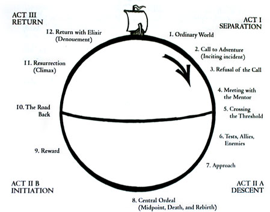

## Hero's Journey Summary
The Hero's Journey begins with the main character, or Hero, in one place, and ends with him in another — both physically and emotionally. The Hero is the same regardless of what story you're telling, which is important because it could be a multi-billionaire who owns dozens of successful companies, or a cashier at a fast food restaurant. In the Hero's Journey, there is also a Mentor -- like Gandalf in Lord of the Rings, or Dumbledore in Harry Potter. The Journey can be replicated in everyone's life to some degree. Here's an illustration:

And a description and example of each (credits to the [Art of Manliness Hero's Journey Summary](https://www.artofmanliness.com/articles/heros-journey/)):

---

**The Ordinary World** - The Hero’s starting point - Dorothy Gale living on her farm (The Wizard of Oz)
The Call to Adventure - The Hero realizes that there is a larger world that he can be a part of - Harry Potter gets a letter from Hogwarts (Harry Potter and the Sorcerer’s Stone)

**Refusal of the Call** - In a moment of doubt, the Hero decides not to undertake the quest - Luke Skywalker tells Obi-Wan Kenobi that he can’t go to Alderaan (Star Wars)

**Meeting with the Mentor** - Either the first encounter with the Mentor figure, or the moment when the Mentor encourages the Hero to take on the Quest	- Daniel LaRusso meets Mr. Miyagi (The Karate Kid)

**Crossing the First Threshold** - The Hero moves from the Ordinary World to the Special World, and sees the difference between the two - The Narrator walks into Tyler Durden’s house for the first time (Fight Club)

**Tests, Allies, and Enemies** - The Hero begins to undertake tasks that will help him prepare for the road ahead; he also meets friends who will aid him, and foes who will try to stop him - Frodo leaves Rivendell with the Fellowship of the Ring, and has to learn how to be on the road as he goes (The Lord of the Rings)

**Approach** - Internal and external preparation; usually includes an imposing destination - Neo and Trinity gather an arsenal before heading off to rescue Morpheus (The Matrix)

**The Ordeal** - The central conflict in the story, the big boss fight, where the possibility of death is imminent - Dorothy and her friends battle the Wicked Witch in her castle (The Wizard of Oz)

**Seizing the Sword/Reward** - Having slain the enemy, the Hero is free to take the treasure; sometimes this is an item of great value, like the Holy Grail, or a person, but very often it’s something more abstract, like the end to a war	- After the death of the dragon Smaug, Bilbo and the dwarves are free to help themselves to his treasure (The Hobbit)

**Apotheosis and Resurrection** - Often, the Hero needs for all of his growth to come to a head and manifest itself all at once in a moment of enlightenment called apotheosis; this realization is the death blow to the old self and beliefs, and the embracing of the new; this is punctuated by a symbolic (sometimes literal) death and resurrection	- The Narrator realizes that in order for him to stop Tyler Durden, he must kill himself — by making peace with his own death he accepts mortality, and is, for a moment, truly at peace; he shoots himself and lives, though Tyler is dead (Fight Club)

**The Road Back** - The Special World, with all of its lessons and adventures, may have become more comfortable than the Ordinary World, and for some Heroes, returning can be harder than the initial departure. - After the One Ring is destroyed, Frodo has a hard time adapting to life as a normal Hobbit in the Shire (Return of the King).

**Return with the Elixir and the Master of Two Worlds** - The Hero returns home changed, and uses the gifts he received and lessons he learned on the journey to better others; at the same time, the Hero must come to terms with all of the personal changes he’s undergone; he must reconcile who he was with who he has become - Luke, now a Jedi, restores balance to the Force, helping bring peace to the galaxy; concurrently, he is able to resolve his relationship with his father and move on (Return of the Jedi)

---

Knowing each of the steps of the Hero's Journey allows you to understand changes happening in your life and the path to your end goal(s) in life. Anything can fit into at least one of the stages above.

---
[Day 10](./day-10) | [Home](./)